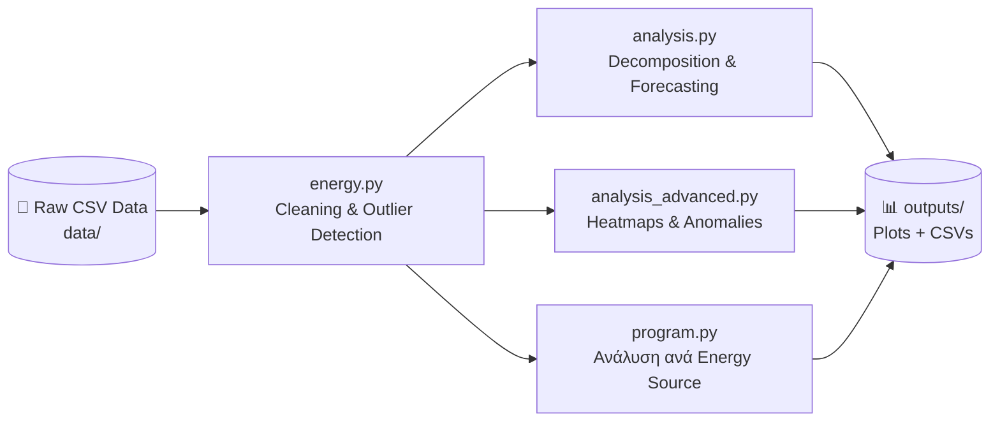

# ⚡ Ανάλυση Ανανεώσιμης Ενέργειας — ADMIE (Ελλάδα)


Ανάλυση δεδομένων παραγωγής **ανανεώσιμης ενέργειας στην Ελλάδα**, με στοιχεία από τον διαχειριστή **ADMIE** (data.gov.gr). Το repository εφαρμόζει τεχνικές ανάλυσης χρονοσειρών — decomposition, ανίχνευση εποχικότητας, rolling statistics, ανίχνευση ανωμαλιών και βασικές προβλέψεις — πάνω σε πραγματικά δεδομένα ωριαίας παραγωγής (MWh).

> 📌 Αυτό είναι το πρώτο προσωπικό data project του δημιουργού — μια πρακτική εξάσκηση σε Python, pandas και ανάλυση χρονοσειρών πάνω σε πραγματικά, δημόσια δεδομένα ενέργειας.

---

## 📑 Περιεχόμενα

- [Επισκόπηση](#-επισκόπηση)
- [Pipeline Ανάλυσης](#-pipeline-ανάλυσης)
- [Δομή Repository](#-δομή-repository)
- [Scripts — Αναλυτικά](#-scripts--αναλυτικά)
- [Απαιτήσεις](#️-απαιτήσεις--dependencies)
- [Οδηγίες Χρήσης](#-οδηγίες-χρήσης)
- [Παραγόμενα Αποτελέσματα](#-παραγόμενα-αποτελέσματα)

---

## 🚀 Επισκόπηση

| Πεδίο | Λεπτομέρεια |
|---|---|
| **Πηγή Δεδομένων** | ADMIE (Ανεξάρτητος Διαχειριστής Μεταφοράς Ηλεκτρικής Ενέργειας) μέσω data.gov.gr |
| **Τύπος Δεδομένων** | Ωριαία παραγωγή ενέργειας (MWh) ανά πηγή |
| **Γλώσσα** | Python 3.11+ |
| **Κύριες Τεχνικές** | Time Series Decomposition · Seasonality Analysis · Anomaly Detection · Rolling Statistics · Naive/Moving-Average Forecasting |
| **Στόχος** | Κατανόηση εποχικότητας παραγωγής, ανίχνευση ανωμαλιών, προετοιμασία δεδομένων για μελλοντικές προβλέψεις |

---

## 🔄 Pipeline Ανάλυσης



---

## 📂 Δομή Repository

| Φάκελος / Αρχείο | Περιγραφή |
|---|---|
| `data/` | Raw δεδομένα παραγωγής σε CSV (ωριαία MWh) |
| `outputs/` | Όλα τα plots και CSV αποτελέσματα που παράγονται από τα scripts |
| `scripts/analysis.py` | Βασική ανάλυση χρονοσειρών: decomposition, weekly patterns, forecasts |
| `scripts/analysis_advanced.py` | Προχωρημένη ανάλυση: heatmaps, rolling statistics, ανίχνευση ανωμαλιών |
| `scripts/program.py` | Ανάλυση ανά energy source και μηνιαία trends |
| `scripts/energy.py` | Data cleaning, ανίχνευση outliers, hourly/monthly patterns, trend analysis |
| `README.md` | Τεκμηρίωση repository |

---

## 📝 Scripts — Αναλυτικά

### 1️⃣ `analysis.py` — Βασική Ανάλυση Χρονοσειράς

| Πεδίο | Λεπτομέρεια |
|---|---|
| **Λειτουργίες** | Time series decomposition (trend/seasonal/residual) · Weekly patterns (Weekday vs Weekend) · Naive & Moving Average forecasting · Υπολογισμός MAE & RMSE |
| **Παραγόμενα Plots** | `decomposition.png`, `weekly_patterns.png`, `forecast.png` |
| **Παραγόμενο CSV** | `metrics.csv` (MAE & RMSE) |

### 2️⃣ `analysis_advanced.py` — Προχωρημένη Ανάλυση

| Πεδίο | Λεπτομέρεια |
|---|---|
| **Λειτουργίες** | Heatmap παραγωγής ανά ώρα/ημέρα · Rolling statistics (μέσος όρος, τυπική απόκλιση) · Ανίχνευση ανωμαλιών (outliers) |
| **Παραγόμενα Plots** | `heatmap_energy.png`, `rolling_stats.png`, `anomalies.png` |
| **Παραγόμενο CSV** | `anomalies.csv` |

### 3️⃣ `program.py` — Ανάλυση ανά Πηγή Ενέργειας

| Πεδίο | Λεπτομέρεια |
|---|---|
| **Λειτουργίες** | Συνολική παραγωγή ανά energy source (bar chart) · Μηνιαία παραγωγή ανά source (line chart) · Seasonal trends στην κονσόλα |
| **Παραγόμενα Plots** | `total_production.png`, `monthly_trends.png` |

### 4️⃣ `energy.py` — Καθαρισμός & Ανάλυση Τάσεων

| Πεδίο | Λεπτομέρεια |
|---|---|
| **Λειτουργίες** | Data cleaning & data quality checks · Ανίχνευση outliers με μέθοδο IQR · Hourly & monthly patterns · Trend analysis με rolling mean |
| **Παραγόμενα Plots** | `monthly_seasonality.png`, `hourly_patterns.png`, `trend_analysis.png` |
| **Παραγόμενο CSV** | `outliers_report.csv` |

---

## ⚙️ Απαιτήσεις / Dependencies

| Κατηγορία | Βιβλιοθήκες |
|---|---|
| **Core** | `pandas`, `numpy`, `matplotlib`, `statsmodels`, `scikit-learn` |
| **Προαιρετικά (advanced visualizations)** | `seaborn`, `plotly` |
| **Python Version** | 3.11+ |

Εγκατάσταση όλων μαζί:

```bash
pip install pandas numpy matplotlib statsmodels scikit-learn seaborn plotly
```

---

## ▶️ Οδηγίες Χρήσης

### 1. Κλωνοποίηση repository

```bash
git clone https://github.com/Dimitriskatsanos42/Admie-renewable-energy-data.git
cd Admie-renewable-energy-data
```

### 2. Εγκατάσταση εξαρτήσεων

```bash
pip install -r requirements.txt
```

### 3. Εκτέλεση ανάλυσης

| Script | Εντολή |
|---|---|
| Βασική ανάλυση | `python scripts/analysis.py` |
| Προχωρημένη ανάλυση | `python scripts/analysis_advanced.py` |
| Ανάλυση ανά πηγή | `python scripts/program.py` |
| Καθαρισμός & trends | `python scripts/energy.py` |

Τα αποτελέσματα (plots & CSVs) αποθηκεύονται αυτόματα στον φάκελο `outputs/`.

---

## 📊 Παραγόμενα Αποτελέσματα

| Τύπος | Αρχεία |
|---|---|
| **Decomposition & Forecasting** | `decomposition.png`, `weekly_patterns.png`, `forecast.png`, `metrics.csv` |
| **Anomaly Detection** | `heatmap_energy.png`, `rolling_stats.png`, `anomalies.png`, `anomalies.csv` |
| **Ανάλυση ανά Πηγή** | `total_production.png`, `monthly_trends.png` |
| **Seasonality & Trends** | `monthly_seasonality.png`, `hourly_patterns.png`, `trend_analysis.png`, `outliers_report.csv` |

---

